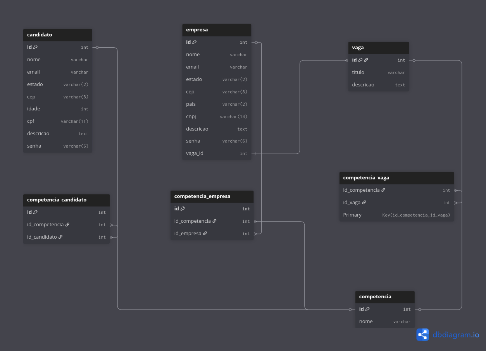

# Linketinder 

**Desenvolvido por:** Augusto S. Lima

## 📋 Sobre o Projeto

O Linketinder é uma aplicação desenvolvida em Groovy e TypeScript que conecta candidatos e empresas, facilitando o processo de recrutamento. O projeto possui duas implementações distintas:
- **Backend/CLI em Groovy**: Interface de linha de comando para cadastro e gerenciamento
- **Frontend em TypeScript**: Interface web moderna e interativa

*Nota: Atualmente as duas implementações funcionam de forma independente e não estão integradas.*

## 🚀 Tecnologias Utilizadas

### Backend (Groovy)
- **Groovy** - Linguagem principal do backend
- **Gradle** - Gerenciamento de dependências e build

### Frontend (TypeScript)
- **TypeScript** - Linguagem principal do frontend
- **Vite** - Build tool e servidor de desenvolvimento
- **HTML5/CSS3** - Interface e estilização
- **JavaScript ES6+** - Funcionalidades interativas

### Banco de Dados (PostgreSQL)
- **PostgreSQL 15+** - Sistema de gerenciamento de banco de dados relacional
- **pgAdmin 4** - Interface gráfica para administração do PostgreSQL
- **dbdiagram.io** - Ferramenta de modelagem e documentação do banco de dados

### Ferramentas de Desenvolvimento
- **IntelliJ IDEA** - IDE de desenvolvimento

## 📁 Estrutura do Projeto

```
Linketinder/
├── src/                          # Backend Groovy
│   ├── main/
│   │   └── groovy/
│   │       └── com/augusto/linketinder/
│   │           ├── control/
│   │           │   ├── CadastroController.groovy
│   │           │   ├── DeleteController.groovy
│   │           │   └── MenuController.groovy
│   │           ├── model/
│   │           │   ├── lista/
│   │           │   │   ├── EnumCompetencias.groovy
│   │           │   │   ├── ListaFisicaEstatica.groovy
│   │           │   │   └── ListaJuridicaEstatica.groovy
│   │           │   └── pessoa/
│   │           │       ├── Pessoa.groovy
│   │           │       ├── PessoaFisica.groovy
│   │           │       └── PessoaJuridica.groovy
│   │           └── view/
│   │               ├── create/
│   │               ├── delete/
│   │               ├── menu/
│   │               ├── read/
│   │               └── update/
│   │       ├── App.groovy
│   │       └── ScriptPopularDadosInicial.groovy
│   └── test/
├── frontend/                     # Frontend TypeScript
│   ├── src/
│   │   ├── components/
│   │   │   ├── form-cadastro.ts
│   │   │   ├── form-login.ts
│   │   │   ├── grafico.ts
│   │   │   ├── homeGenerator.ts
│   │   │   └── listar.ts
│   │   ├── handlers/
│   │   │   └── formHandler.ts
│   │   ├── helpers/
│   │   │   ├── formHelper.ts
│   │   │   └── homeHelpers.ts
│   │   ├── models/
│   │   │   ├── Candidato.ts
│   │   │   ├── Empresa.ts
│   │   │   ├── Pessoa.ts
│   │   │   └── Vaga.ts
│   │   ├── pages/
│   │   │   ├── cadastro.ts
│   │   │   ├── home.ts
│   │   │   ├── login.ts
│   │   │   └── menu.ts
│   │   ├── storage/
│   │   │   └── lists.ts
│   │   ├── styles/
│   │   │   ├── style.css
│   │   │   ├── style-cadastro.css
│   │   │   ├── style-home.css
│   │   │   ├── style-login.css
│   │   │   └── style-menu.css
│   │   ├── templates/
│   │   │   ├── cadastroCandidato.html
│   │   │   ├── cadastroEmpresa.html
│   │   │   ├── homeCandidato.html
│   │   │   ├── homeEmpresa.html
│   │   │   ├── login.html
│   │   │   └── menu.html
│   │   ├── main.ts
│   │   └── router.ts
│   ├── public/
│   ├── index.html
│   ├── package.json
│   └── tsconfig.json
├── build.gradle
├── scriptEstruturaBasica.sql     
├── scriptPopulacaoInicialDados.sql 
├── MER-Inicial.png               
└── README.md
```

## 🏗️ Arquitetura

### Backend (MVC em Groovy)
O backend segue o padrão arquitetural MVC (Model-View-Controller):
- **Model**: Classes de domínio e estruturas de dados
- **View**: Interface de linha de comando
- **Controller**: Lógica de negócio e comunicação entre camadas

### Frontend (SPA em TypeScript)
O frontend utiliza uma arquitetura de Single Page Application (SPA):
- **Components**: Componentes reutilizáveis da interface
- **Pages**: Páginas da aplicação
- **Models**: Definições de tipos e interfaces TypeScript
- **Handlers**: Lógica de manipulação de eventos
- **Storage**: Gerenciamento de dados em localStorage

### Banco de Dados (PostgreSQL)
O banco de dados foi modelado seguindo as melhores práticas de normalização e integridade referencial:

#### Estrutura do Banco
- **7 Tabelas principais**: competencia, candidato, empresa, vaga, competencia_candidato, competencia_vaga, competencia_empresa
- **Normalização**: Atende até a 4ª Forma Normal (4FN)
- **Relacionamentos**: N:N entre entidades através de tabelas associativas
- **Integridade**: Chaves estrangeiras com CASCADE para manter consistência

#### Modelo Entidade-Relacionamento (MER)



**Principais entidades e relacionamentos:**
- **Candidato** possui múltiplas competências (N:N via competencia_candidato)
- **Empresa** possui múltiplas competências (N:N via competencia_empresa)
- **Vaga** pertence a uma empresa (N:1) e requer múltiplas competências (N:N via competencia_vaga)
- **Competência** é compartilhada entre candidatos, empresas e vagas

## ⚙️ Funcionalidades

### Backend (CLI Groovy)
- ✅ Cadastro de candidatos e empresas via linha de comando
- ✅ Visualização de registros
- ✅ Gerenciamento CRUD básico
- ✅ Sistema de competências

### Frontend (Web TypeScript)
- ✅ Interface web responsiva
- ✅ Sistema de login/cadastro
- ✅ Páginas dedicadas para candidatos e empresas
- ✅ Formulários interativos
- ✅ Gráficos e visualizações
- ✅ Armazenamento local (localStorage)
- ✅ Roteamento SPA

### Banco de Dados (PostgreSQL)
- ✅ Estrutura normalizada até 4FN
- ✅ Relacionamentos N:N com tabelas associativas
- ✅ Integridade referencial com constraints
- ✅ Scripts automatizados de criação e população
- ✅ Suporte a múltiplas competências por entidade

## 🛠️ Como Executar

### Backend (Groovy)

**Pré-requisitos:**
- Java 8 ou superior
- Gradle instalado

**Execução:**
```bash
# Via Gradle
gradle run

# Via IntelliJ IDEA
# Navegue até App.groovy e execute
```

### Frontend (TypeScript)

**Pré-requisitos:**
- Node.js 16+ instalado
- npm ou yarn

**Execução:**
```bash
# Navegue até a pasta frontend
cd frontend

# Instale as dependências
npm install

# Execute em modo de desenvolvimento
npm run dev

# Build para produção
npm run build

# Preview da build de produção
npm run preview
```

### Banco de Dados (PostgreSQL)

**Pré-requisitos:**
- PostgreSQL 15+ instalado
- pgAdmin 4 (opcional, para interface gráfica)
- Acesso ao terminal PostgreSQL (psql)

**Configuração inicial:**

1. **Criar o banco de dados:**
```bash
# Via terminal psql
psql -U postgres
CREATE DATABASE linketinder;
\q
```

2. **Executar script de estrutura:**
```bash
# Via terminal
psql -U postgres -d linketinder -f scriptEstruturaBasica.sql

# Ou via pgAdmin 4
# Abra o Query Tool e execute o conteúdo do arquivo scriptEstruturaBasica.sql
```

3. **Popular com dados iniciais:**
```bash
# Via terminal
psql -U postgres -d linketinder -f scriptPopulacaoInicialDados.sql

# Ou via pgAdmin 4
# Execute o conteúdo do arquivo scriptPopulacaoInicialDados.sql
```

**Estrutura criada:**
- 7 tabelas relacionadas
- 5 candidatos (personagens de The Office)
- 5 empresas
- 5 vagas de emprego
- 6 competências técnicas
- Relacionamentos configurados entre todas as entidades

**Verificar instalação:**
```sql
-- Conectar ao banco
psql -U postgres -d linketinder

-- Verificar tabelas criadas
\dt

-- Consultar dados
SELECT * FROM candidato;
SELECT * FROM empresa;
SELECT * FROM vaga;
```

## 🌐 Acesso à Aplicação

### Backend
- **Tipo**: Interface de linha de comando (CLI)
- **Execução**: Via terminal após executar `gradle run`

### Frontend
- **Tipo**: Aplicação web (SPA)
- **URL de desenvolvimento**: `http://localhost:5173` (após `npm run dev`)
- **Funcionalidades**: Interface completa com login, cadastros e visualizações

### Banco de Dados
- **Tipo**: PostgreSQL
- **Porta padrão**: 5432
- **Nome do banco**: linketinder
- **Acesso via pgAdmin**: `http://localhost:5050` (se configurado)
- **Acesso via psql**: `psql -U postgres -d linketinder`

## 📋 Funcionalidades Detalhadas

### Recursos do Frontend Web:
1. **Página de Login**: Autenticação de candidatos e empresas
2. **Cadastro Duplo**: Formulários específicos para candidatos e empresas
3. **Dashboard Candidatos**: 
   - Visualização de perfil
   - Listagem de vagas disponíveis
   - Gráficos de competências
4. **Dashboard Empresas**:
   - Gestão de vagas
   - Visualização de candidatos
   - Análises e métricas
5. **Navegação SPA**: Roteamento sem recarregamento de página

### Recursos do Banco de Dados:
1. **Tabela Candidato**: Armazena informações pessoais e profissionais
2. **Tabela Empresa**: Dados cadastrais das empresas recrutadoras
3. **Tabela Vaga**: Descrição das oportunidades de trabalho
4. **Tabela Competência**: Catálogo de habilidades técnicas
5. **Tabelas Associativas**: Relacionam competências com candidatos, empresas e vagas
6. **Constraints de Integridade**: Garantem consistência dos dados
7. **Cascata de Operações**: Atualizações e deleções propagadas automaticamente

## 🚧 Próximos Passos

- [ ] **Integração Backend-Frontend**: Conectar as duas implementações
- [ ] **API REST**: Criar endpoints para comunicação
- [ ] **Conexão com PostgreSQL**: Migrar do armazenamento em memória/localStorage para banco real
- [ ] **DAO Layer**: Implementar camada de acesso a dados
- [ ] **Connection Pool**: Configurar pool de conexões eficiente
- [ ] **Sistema de Matching**: Algoritmo de compatibilidade baseado em competências
- [ ] **Autenticação JWT**: Sistema de autenticação robusto
- [ ] **Queries Otimizadas**: Implementar índices e otimizar consultas
- [ ] **Deploy**: Preparar para produção

## 🎯 Objetivo do Projeto

O Linketinder visa criar uma ponte entre candidatos e empresas através de:
- Interface intuitiva e moderna (frontend web)
- Sistema robusto de gerenciamento (backend CLI)
- Banco de dados estruturado e normalizado
- Futuro sistema de matching inteligente baseado em competências
- Experiência completa de recrutamento

## 📝 Notas Técnicas

- **Backend**: Utiliza listas estáticas em memória (migração para PostgreSQL planejada)
- **Frontend**: Usa localStorage para persistência local (migração para API planejada)
- **Banco de Dados**: PostgreSQL com estrutura normalizada até 4FN
- **Modelagem**: Desenvolvida em dbdiagram.io e exportada para SQL
- **Arquitetura**: Preparada para futura integração via API REST
- **Compatibilidade**: Frontend responsivo para diferentes dispositivos

## 🤝 Contribuições

Sinta-se à vontade para contribuir com:
- Melhorias na interface
- Novas funcionalidades
- Otimizações no banco de dados
- Correções de bugs
- Integração backend-frontend

## 📄 Licença

Este projeto foi desenvolvido para fins educacionais.

---

**Desenvolvido por Augusto S. Lima**