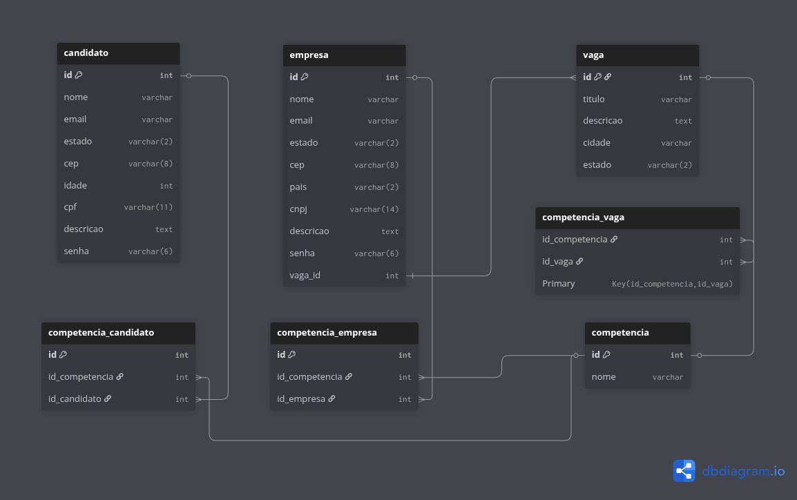

# Linketinder

**Desenvolvido por:** Augusto S. Lima

## 📋 Sobre o projeto

Linketinder conecta candidatos e empresas por meio de um backend em Groovy (CLI) e um frontend moderno em TypeScript. As duas implementações ainda não estão integradas, mas compartilham o mesmo domínio e scripts de banco de dados, preparando o caminho para uma futura API REST.

## 🚀 Tecnologias

- Backend: Groovy 3, Gradle, testes unitários em Spock/GroovyTest
- Frontend: TypeScript, Vite, HTML5, CSS3, localStorage
- Banco de dados: PostgreSQL 15+, scripts SQL versionados
- Ferramentas de apoio: IntelliJ IDEA, pgAdmin, dbdiagram.io

## 🧭 Estrutura do projeto

```
Linketinder/
├── backend/
│   ├── build.gradle
│   ├── gradlew
│   └── src/
│       ├── main/groovy/com/augusto/linketinder/
│       │   ├── control/        # Controllers da CLI
│       │   ├── dao/            # DAOs, factories e providers de conexão
│       │   ├── model/          # Modelos do domínio (pessoa, vaga, competência)
│       │   ├── view/           # Views para interação via terminal
│       │   └── App.groovy      # Entrada principal da aplicação CLI
│       └── test/groovy/        # Testes (usa H2 in-memory)
├── frontend/
│   ├── index.html
│   ├── package.json
│   ├── tsconfig.json
│   └── src/
│       ├── components/         # Componentes reutilizáveis de UI
│       ├── factories/          # FormFactory, PageFactory, etc.
│       ├── handlers/           # FormHandler e orquestração de eventos
│       ├── helpers/            # Funções utilitárias (formHelper, homeHelper)
│       ├── models/             # Modelos/DTOs TypeScript
│       ├── pages/              # Páginas SPA (login, cadastro, home, menu)
│       ├── storage/            # Listas e acesso ao localStorage
│       ├── templates/          # HTML partials injetados dinamicamente
│       └── validators/         # Cadeia de validadores (Chain of Responsibility)
├── database/
│   ├── scriptEstruturaBasica.sql
│   ├── scriptPopulacaoInicialDados.sql
│   └── MER-Inicial.png
└── README.md
```

## 🏗️ Arquitetura

### Backend (CLI em Groovy)
- Padrão MVC aplicado: models representam domínio (candidatos, empresas, vagas); controllers coordenam fluxo da CLI; views cuidam da interação textual.
- Camada de dados desacoplada via `ConnectionProvider`. A `DAOFactory` injeta automaticamente `JDBCConnectionProvider` (PostgreSQL) ou `H2ConnectionProvider` (testes) conforme `DB_PROVIDER` ou `-DDB_PROVIDER=h2`.
- DAOs encapsulam SQL e trabalham com o provider selecionado, permitindo trocar o banco sem alterar regras de negócio.
- Testes utilizam banco H2 in-memory para garantir isolamento.

### Frontend (SPA em TypeScript)
- Estrutura SPA com roteamento simples (`src/router.ts`).
- Factories (`FormFactory`, `PageFactory`) constroem elementos on-demand, facilitando composição e testes.
- Validações seguem Chain of Responsibility (`validators/chain/*`), permitindo adicionar regras sem quebrar o fluxo.
- Handlers orquestram submissão e feedback de formulários, apoiados por helpers e models tipados.

### Banco de Dados (PostgreSQL)
O banco de dados foi modelado seguindo as melhores práticas de normalização e integridade referencial:

#### Estrutura do Banco
- **7 Tabelas principais**: competencia, candidato, empresa, vaga, competencia_candidato, competencia_vaga, competencia_empresa
- **Normalização**: Atende até a 4ª Forma Normal (4FN)
- **Relacionamentos**: N:N entre entidades através de tabelas associativas
- **Integridade**: Chaves estrangeiras com CASCADE para manter consistência

#### Modelo Entidade-Relacionamento (MER)



**Principais entidades e relacionamentos:**
- **Candidato** possui múltiplas competências (N:N via competencia_candidato)
- **Empresa** possui múltiplas competências (N:N via competencia_empresa)
- **Vaga** pertence a uma empresa (N:1) e requer múltiplas competências (N:N via competencia_vaga)
- **Competência** é compartilhada entre candidatos, empresas e vagas

## 🧩 Padrões de projeto em uso
- **Factory**: `DAOFactory`, `DataSourceFactory`, `FormFactory`, `PageFactory`.
- **DAO**: encapsula persistência e mantém controllers enxutos.
- **Provider**: `ConnectionProvider` para abstrair fonte de dados (JDBC x H2).
- **Chain of Responsibility**: validadores sequenciais no frontend.
- **Handler**: gerenciamento de eventos e submissões de formulários.

## ⚙️ Funcionalidades

### Backend (CLI Groovy)
- ✅ Cadastro de candidatos e empresas via linha de comando
- ✅ Visualização de registros
- ✅ Gerenciamento CRUD completo
- ✅ Sistema de competências
- ✅ Integração com PostgreSQL e H2 (testes)

### Frontend (Web TypeScript)
- ✅ Interface web responsiva
- ✅ Sistema de login/cadastro
- ✅ Páginas dedicadas para candidatos e empresas
- ✅ Formulários interativos com validação em cadeia
- ✅ Gráficos e visualizações
- ✅ Armazenamento local (localStorage)
- ✅ Roteamento SPA

### Banco de Dados (PostgreSQL)
- ✅ Estrutura normalizada até 4FN
- ✅ Relacionamentos N:N com tabelas associativas
- ✅ Integridade referencial com constraints
- ✅ Scripts automatizados de criação e população
- ✅ Suporte a múltiplas competências por entidade

## 🛠️ Como executar

### Backend (Groovy)
Pré-requisitos: JDK 8+ e Gradle Wrapper (já incluso).

```bash
cd backend
./gradlew run            # executa a CLI

# Rodar testes (usa H2 por padrão quando DB_PROVIDER=h2)
export DB_PROVIDER=h2
./gradlew test

# Alternativa via propriedade JVM
./gradlew -DDB_PROVIDER=h2 test
```

### Frontend (TypeScript)
Pré-requisitos: Node.js 16+ e npm.

```bash
cd frontend
npm install
npm run dev       # modo desenvolvimento (http://localhost:5173)
npm run build     # build produção
npm run preview   # serve build de produção
```

### Banco de Dados (PostgreSQL)

**Pré-requisitos:**
- PostgreSQL 15+ instalado
- pgAdmin 4 (opcional, para interface gráfica)
- Acesso ao terminal PostgreSQL (psql)

**Configuração inicial:**

```bash
# criar banco
psql -U postgres -c "CREATE DATABASE linketinder;"

# criar estrutura
psql -U postgres -d linketinder -f database/scriptEstruturaBasica.sql

# popular dados iniciais
psql -U postgres -d linketinder -f database/scriptPopulacaoInicialDados.sql
```

**Verificar instalação:**
```sql
-- Conectar ao banco
psql -U postgres -d linketinder

-- Verificar tabelas criadas
\dt

-- Consultar dados
SELECT * FROM candidato;
SELECT * FROM empresa;
SELECT * FROM vaga;
```

**Estrutura criada:**
- 7 tabelas relacionadas
- 5 candidatos (personagens de The Office)
- 5 empresas
- 5 vagas de emprego
- 6 competências técnicas
- Relacionamentos configurados entre todas as entidades

## 🌐 Acesso à Aplicação

### Backend
- **Tipo**: Interface de linha de comando (CLI)
- **Execução**: Via terminal após executar `./gradlew run`

### Frontend
- **Tipo**: Aplicação web (SPA)
- **URL de desenvolvimento**: `http://localhost:5173` (após `npm run dev`)
- **Funcionalidades**: Interface completa com login, cadastros e visualizações

### Banco de Dados
- **Tipo**: PostgreSQL
- **Porta padrão**: 5432
- **Nome do banco**: linketinder
- **Acesso via pgAdmin**: `http://localhost:5050` (se configurado)
- **Acesso via psql**: `psql -U postgres -d linketinder`

## ✅ Funcionalidades atuais
- Cadastro, listagem e atualização básica de candidatos, empresas, vagas e competências pela CLI.
- Interface web com páginas de login, cadastro, dashboard e gráficos.
- Validação de formulários com cadeia configurável de regras.
- Scripts SQL para criação e seed inicial do banco.

## 🎯 Objetivo do Projeto

O Linketinder visa criar uma ponte entre candidatos e empresas através de:
- Interface intuitiva e moderna (frontend web)
- Sistema robusto de gerenciamento (backend CLI)
- Banco de dados estruturado e normalizado
- Futuro sistema de matching inteligente baseado em competências
- Experiência completa de recrutamento

## 📋 Funcionalidades detalhadas

### Frontend web
1. Login e autenticação simplificada (ajustada para integração futura).
2. Fluxos de cadastro distintos para candidatos e empresas.
3. Dashboard do candidato com listagem de vagas e gráficos de competências.
4. Dashboard da empresa com gestão de vagas e visualização de candidatos.
5. SPA com roteamento sem recarregar a página.

### Banco de dados
1. **Tabela Candidato**: Armazena informações pessoais e profissionais
2. **Tabela Empresa**: Dados cadastrais das empresas recrutadoras
3. **Tabela Vaga**: Descrição das oportunidades de trabalho
4. **Tabela Competência**: Catálogo de habilidades técnicas
5. **Tabelas Associativas**: Relacionam competências com candidatos, empresas e vagas
6. **Constraints de Integridade**: Garantem consistência dos dados
7. **Cascata de Operações**: Atualizações e deleções propagadas automaticamente

## 🚧 Próximos Passos

- [ ] **Integração Backend-Frontend**: Conectar as duas implementações via API REST
- [ ] **API REST**: Criar endpoints para comunicação
- [ ] **Connection Pool**: Configurar pool de conexões eficiente (ex.: HikariCP)
- [ ] **Sistema de Matching**: Algoritmo de compatibilidade baseado em competências
- [ ] **Autenticação JWT**: Sistema de autenticação robusto
- [ ] **Testes End-to-End**: Cobertura completa do fluxo de integração
- [ ] **Queries Otimizadas**: Implementar índices e otimizar consultas
- [ ] **Deploy**: Preparar para produção

## 📝 Notas Técnicas

- **Arquitetura**: Projeto modularizado com separação clara entre backend, frontend e database
- **Backend**: Utiliza Banco de Dados conectado em PostgreSQL com arquitetura MVC
- **Frontend**: Usa localStorage para persistência local (migração para API planejada)
- **Banco de Dados**: PostgreSQL com estrutura normalizada até 4FN
- **Modelagem**: Desenvolvida em dbdiagram.io e exportada para SQL
- **Build System**: Gradle para o backend, Vite para o frontend
- **Testes**: Estrutura preparada para testes unitários em Groovy com suporte a H2
- **Compatibilidade**: Frontend responsivo para diferentes dispositivos
- **Design Patterns**: Factory, DAO, Provider, Chain of Responsibility, Handler

## 🤝 Contribuições

Sinta-se à vontade para contribuir com:
- Melhorias na interface
- Novas funcionalidades
- Otimizações no banco de dados
- Correções de bugs
- Integração backend-frontend

## 📄 Licença

Este projeto foi desenvolvido para fins educacionais.

---

**Desenvolvido por Augusto S. Lima**